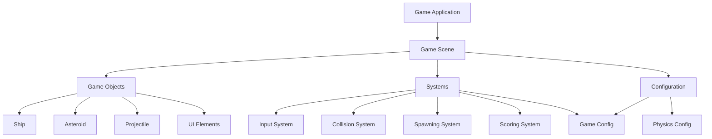

# Asteroids Game Design Document

## Overview

This design document outlines the architecture for an Asteroids clone built with TypeScript and Phaser 3. The game will follow a component-based architecture with clear separation of concerns between game objects, systems, and configuration. The design emphasizes modularity, testability, and maintainability while delivering smooth 60fps gameplay.

**Technology Stack:**
- **Phaser 3**: Game framework for rendering, physics, input handling, and asset management
- **TypeScript**: Type-safe development with modern ES6+ features
- **Webpack**: Module bundling and development server
- **Jest**: Unit testing framework

## Architecture

### High-Level Architecture



### Core Design Patterns

1. **Entity-Component Pattern**: Game objects (Ship, Asteroid, Projectile) inherit from base GameObject class
2. **System Architecture**: Separate systems handle specific concerns (input, collision, spawning)
3. **Configuration-Driven**: All speeds, physics, and gameplay parameters externalized to config
4. **Event-Driven Communication**: Phaser's event system for loose coupling between components

## Components and Interfaces

### Core Interfaces

```typescript
interface IGameObject {
  update(delta: number): void;
  destroy(): void;
  getPosition(): { x: number; y: number };
  getVelocity(): { x: number; y: number };
}

interface ICollidable {
  getBounds(): Phaser.Geom.Rectangle;
  onCollision(other: ICollidable): void;
}

interface IConfigurable {
  applyConfig(config: GameConfig): void;
}
```

### Game Objects

#### Ship Class
- **Responsibilities**: Player movement, rotation, thrust physics, shooting, collision detection
- **Key Methods**: 
  - `handleInput()`: Process keyboard input for movement and shooting
  - `applyThrust()`: Apply forward momentum based on current rotation
  - `wrapAroundScreen()`: Handle screen edge wrapping
  - `shoot()`: Create and fire projectiles
- **Physics**: Uses Phaser's physics body with custom thrust and friction implementation

#### Asteroid Class
- **Responsibilities**: Movement, collision detection, splitting behavior, size management
- **Key Methods**:
  - `split()`: Create smaller asteroids when destroyed
  - `randomizeMovement()`: Set random velocity and rotation
  - `updateSize()`: Handle visual and collision changes based on size
- **Size Types**: Large (64px), Medium (32px), Small (16px)

#### Projectile Class
- **Responsibilities**: Linear movement, collision detection, lifetime management
- **Key Methods**:
  - `checkBounds()`: Remove projectile when off-screen
  - `onHit()`: Handle collision with asteroids
- **Lifecycle**: Auto-destroy after set time or screen exit

#### UI Manager Class
- **Responsibilities**: Score display, lives counter, game over screen, wave notifications
- **Key Methods**:
  - `updateScore()`: Refresh score display
  - `updateLives()`: Update lives counter
  - `showGameOver()`: Display final score and restart option

### Systems

#### Input System
- **Purpose**: Centralized input handling with configurable key bindings
- **Implementation**: Phaser's input manager with custom key mapping
- **Features**: Key repeat handling, input buffering for responsive controls

#### Collision System
- **Purpose**: Efficient collision detection between all game objects
- **Implementation**: Phaser's physics world with custom collision callbacks
- **Optimization**: Spatial partitioning for performance with many objects

#### Spawning System
- **Purpose**: Manage asteroid waves, safe spawning, difficulty progression
- **Implementation**: Timer-based spawning with collision-free zone detection
- **Features**: Progressive difficulty, spawn point validation

#### Scoring System
- **Purpose**: Track score, manage lives, handle game state transitions
- **Implementation**: Event-driven score updates with persistent high scores
- **Scoring**: Large asteroid (20pts), Medium (50pts), Small (100pts)

#### Particle System
- **Purpose**: Create visual effects for ship thrust and object explosions
- **Implementation**: Phaser's particle emitter system with custom configurations
- **Features**: Thrust trails, explosion effects, performance-optimized particle pooling
- **Types**: 
  - Thrust particles: Small, colored particles emitted from ship rear during acceleration
  - Explosion particles: Debris-like particles with physics simulation for asteroid/ship destruction

## Data Models

### Game Configuration
```typescript
interface GameConfig {
  ship: {
    thrustSpeed: number;
    rotationSpeed: number;
    maxSpeed: number;
    friction: number;
    invincibilityTime: number;
  };
  projectile: {
    speed: number;
    maxCount: number;
    lifetime: number;
  };
  asteroid: {
    speeds: {
      large: number;
      medium: number;
      small: number;
    };
    splitCount: { min: number; max: number };
  };
  game: {
    initialLives: number;
    initialAsteroidCount: number;
    waveIncrement: number;
    safeSpawnRadius: number;
  };
  particles: {
    thrust: {
      emissionRate: number;
      particleLifetime: number;
      particleSpeed: number;
      particleSize: number;
      color: string;
    };
    explosion: {
      particleCount: number;
      particleLifetime: number;
      particleSpeed: { min: number; max: number };
      particleSize: { min: number; max: number };
      colors: string[];
    };
  };
}
```

### Game State
```typescript
interface GameState {
  score: number;
  lives: number;
  wave: number;
  isGameOver: boolean;
  isPaused: boolean;
  asteroidCount: number;
}
```

## Error Handling

### Asset Loading
- **Strategy**: Preload all assets with loading screen and error fallbacks
- **Implementation**: Phaser's preloader with retry mechanism for failed loads
- **Fallbacks**: Simple geometric shapes if sprite assets fail to load

### Physics Edge Cases
- **Screen Wrapping**: Robust boundary detection with buffer zones
- **Collision Detection**: Validation of physics body states before collision processing
- **Object Cleanup**: Automatic cleanup of destroyed objects to prevent memory leaks

### Performance Degradation
- **Frame Rate Monitoring**: Automatic quality reduction if FPS drops below threshold
- **Object Pooling**: Reuse projectile and particle objects to reduce garbage collection
- **Culling**: Off-screen object deactivation for performance optimization

## Testing Strategy

### Unit Testing
- **Framework**: Jest with TypeScript support
- **Coverage**: All game logic classes (Ship, Asteroid, Projectile, Systems)
- **Mocking**: Phaser dependencies mocked for isolated testing
- **Test Categories**:
  - Movement and physics calculations
  - Collision detection logic
  - Scoring and game state management
  - Configuration application

### Integration Testing
- **Scene Testing**: Full game scene initialization and object interaction
- **Input Testing**: Keyboard input processing and game object responses
- **System Integration**: Interaction between spawning, collision, and scoring systems

### Performance Testing
- **Frame Rate**: Automated testing with high object counts
- **Memory Usage**: Monitoring for memory leaks during extended gameplay
- **Load Testing**: Asset loading performance and error handling

### Manual Testing
- **Gameplay Testing**: Full playthrough testing for game balance and fun factor
- **Browser Compatibility**: Testing across Chrome, Firefox, Safari, and Edge
- **Device Testing**: Performance validation on various hardware configurations

## Implementation Notes

### Phaser 3 Specific Considerations
- **Scene Management**: Single game scene with menu overlay for simplicity
- **Physics**: Arcade physics for performance, custom implementations for specific behaviors
- **Asset Pipeline**: Texture atlas for sprites, audio sprite for sound effects
- **Input Handling**: Cursor keys and WASD support with customizable bindings

### TypeScript Best Practices
- **Strict Mode**: Full TypeScript strict mode for type safety
- **Interfaces**: Comprehensive interface definitions for all major components
- **Generics**: Type-safe event handling and object pooling
- **Modules**: ES6 module system with clear import/export structure

### Performance Optimizations
- **Object Pooling**: Reuse projectiles and explosion particles
- **Efficient Rendering**: Minimize draw calls through sprite batching
- **Update Optimization**: Delta-time based updates with frame skipping fallback
- **Memory Management**: Proper cleanup of event listeners and physics bodies